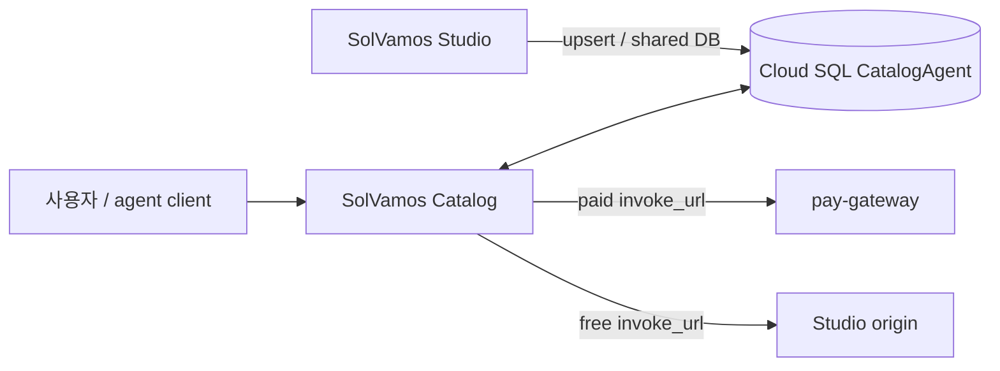

# SolVamos Catalog

SolVamos agent의 공개 landing, marketplace, discovery API다.

영속 listing source of truth는 Studio와 공유하는 PostgreSQL `CatalogAgent` 테이블이고, 이 서비스는 외부 discovery의 권위 있는 surface다. `DATABASE_URL`이 없는 local development에서만 file store로 fallback한다.

## Surface

- Landing: `/`
- Marketplace: `/marketplace`
- Agent detail: `/a/:agentId`
- Catalog JSON: `/api/catalog`
- Agent JSON: `/api/solvamos/:agentId`
- Markdown card: `/api/solvamos/:agentId/index.md`
- Studio upsert: `POST /api/catalog/agents`
- Bulk hydrate: `POST /api/catalog/agents/bulk`
- Unlist: `POST /api/catalog/agents/:agentId/unlist`

## Architecture



유료 listing은 pay-gateway `/v1/agents/:id/invoke`만 공개한다. 무료 listing은 Studio `/api/agents/:id/invoke`를 직접 공개한다.

## Auth for writes

```env
CATALOG_ADMIN_SECRET=shared-secret
```

Studio와 Catalog는 같은 `CATALOG_ADMIN_SECRET`을 사용한다.

```http
X-Catalog-Admin-Secret: <shared-secret>
```

Production에서는 secret이 없으면 write API가 503, 값이 다르면 401이다. 장기적으로 shared secret 대신 service-to-service IAM/OIDC가 권장된다.

## Quick start

```bash
cp .env.example .env
npm install
npm run dev
```

## Production

Catalog Cloud Run:

```env
NODE_ENV=production
DATABASE_URL=postgresql://...
PUBLIC_BASE_URL=https://<catalog>.run.app
STUDIO_URL=https://solvamos-studio-74094114833.asia-northeast3.run.app
PAY_GATEWAY_URL=https://solvamos-pay-gateway-74094114833.asia-northeast3.run.app
CATALOG_ADMIN_SECRET=<shared>
```

Studio Cloud Run:

```env
DATABASE_URL=<same Cloud SQL>
CATALOG_SITE_URL=https://<catalog>.run.app
PAY_GATEWAY_URL=https://<gateway>.run.app
CATALOG_ADMIN_SECRET=<same>
```

Prisma migration은 Studio repository가 소유한다. Catalog 배포에서는 `prisma generate`만 수행한다.

## Data contract

`CatalogAgent`는 다음 정보를 제공한다.

- agent ID/FQN/title/description/category/tags
- Studio origin과 discovery Agent Card URL (`/api/agents/:id/agent-card`)
- `feeUsdc`, token, network, USDC mint
- payment protocol
- public invoke URL (유일한 상업 실행 경로)
- recipient vault
- owner/tenant metadata
- listed/unlisted/paused 상태

Marketplace는 seed/mock source를 제외한 `listed` agent만 표시한다.

## Paid invocation

```text
Catalog invoke_url
  → pay-gateway
  → HTTP 402 x402/MPP
  → USDC payment
  → gateway proxy to Studio internal /v1/agents/:id/invoke
```

Google A2A JSON-RPC(`message/send`)는 공개 커머스 경로로 쓰지 않는다. Agent Card는 디스커버리 문서이고 실행은 항상 `invoke_url`이다. 자세한 정책은 Studio `docs/A2A.md`.

현재 gateway provider는 `0.001` 고정 metering이고 Catalog fee는 가변이므로 동적 가격 동기화가 후속 P0 과제다.

## 관련 문서

전체 시스템 기준 문서는 Studio repository에 있다.

- `solvamos-studio/docs/ARCHITECTURE.md`
- `solvamos-studio/docs/PROCESSES.md`
- `solvamos-studio/docs/ROADMAP.md`
- `solvamos-studio/docs/CATALOG_INTEGRATION.md`
